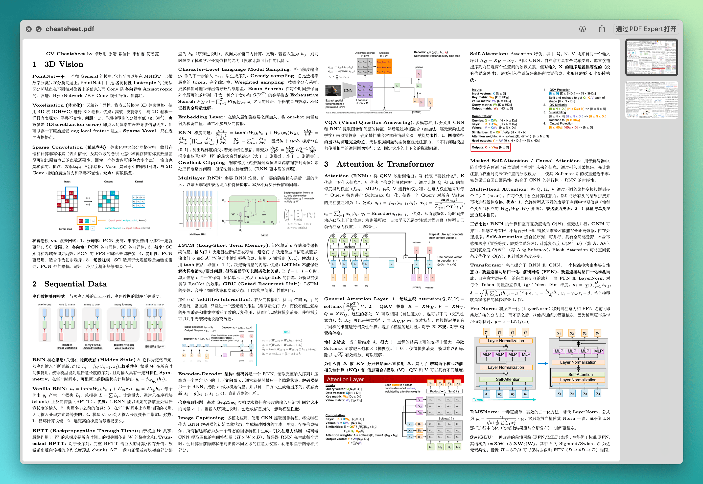

# Cheatsheet 模板

这是一个基于 Pandoc + LaTeX 的 Cheatsheet 模板项目，用于将 Markdown 文件快速转换为紧凑美观、矢量化的 Cheat Sheet PDF。模板支持中文内容，采用 A4 横向排版，四栏布局。

效果：



目前在 macOS 下测试通过，其他系统未测试。

## 🚀 快速开始

确保系统已安装 `pandoc` 和 `xelatex`（TeX Live 或 MiKTeX）。运行编译脚本即可生成 PDF：

```bash
./compile.sh
```

编译完成后会在根目录生成 `cheatsheet.pdf` 文件。

你可以使用 `monitor.sh` 来检测更改并自动编译。

```bash
./monitor.sh
```

## 📁 项目结构

```bash
.
├── source/ # 存放所有 Markdown 源文件
├── template/ # 包含 LaTeX 模板配置文件
├── cheatsheet.tex # 编译过程中生成的中间 LaTeX 文件，可以在此基础上微调修改
├── cheatsheet.pdf # 最终输出的 PDF 文档
├── compile.sh # 自动化编译脚本
├── monitor.sh # 检测更改并自动编译
├── README.md # 本文件
└── LICENSE # 许可证
```

## ⚙️ 编译过程

编译脚本执行以下步骤：

1. **合并源文件**：将 `source/` 目录下所有符合 `Cheatsheet-0*.md` 命名模式的文件按序合并为 `source/Cheatsheet-All.md`
2. **格式转换**：使用 Pandoc 将合并后的 Markdown 文件转换为 LaTeX 格式，应用模板样式配置
3. **PDF 编译**：使用 XeLaTeX 引擎编译 LaTeX 文件生成 PDF，运行两次确保交叉引用正确
4. **清理临时文件**：删除编译过程中产生的辅助文件，保持目录整洁

## 📝 内容组织规范

1. **文件命名** 源文件必须遵循 `Cheatsheet-XX-名称.md` 格式，其中 XX 为两位数字编号，确保合并时的正确顺序
2. **章节结构** 每个文件以一级标题开始，内容使用二级及更低级别标题组织
3. **内容密度** 优先使用**加粗**强调重点，避免过多使用列表等占用空间的格式
4. **数学公式** 支持 LaTeX 数学语法，行内公式使用 `$...$`，独立公式使用 `$$...$$`
5. **宽高比例** 强烈推荐使用 **2:1（宽：高）或更高宽高比** 的图片，这样可以显著减少垂直空间占用，在有限页面中容纳更多内容，你可以将几张图拼在一起形成一张比较宽的图片
6. **禁用表格** 目前已知转换 Markdown 表格语法时会出现问题

## ⚖️ LICENSE

MIT