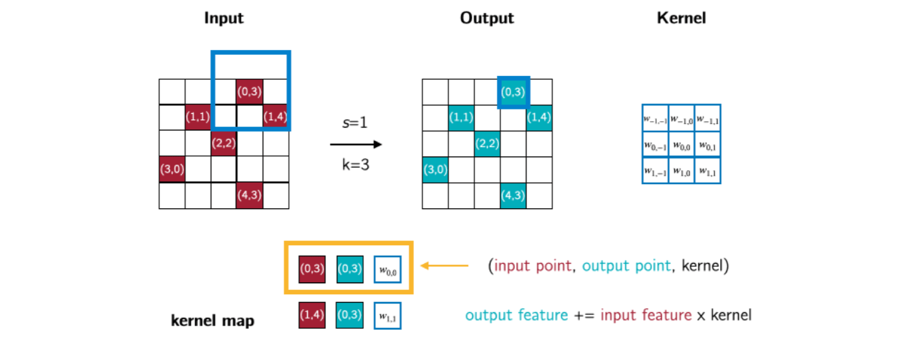
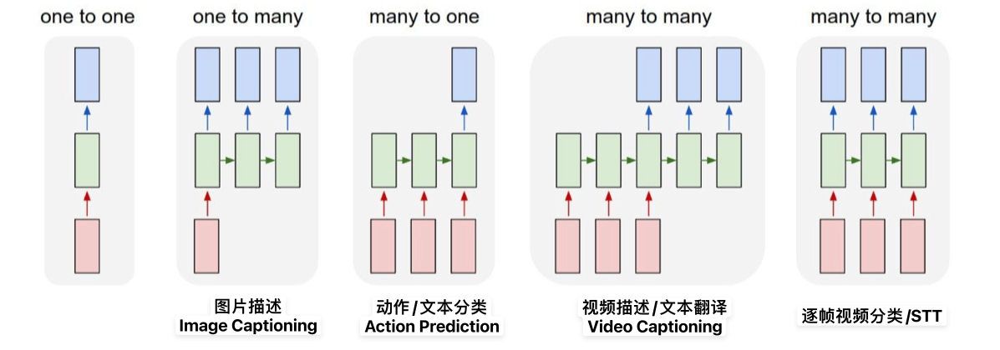
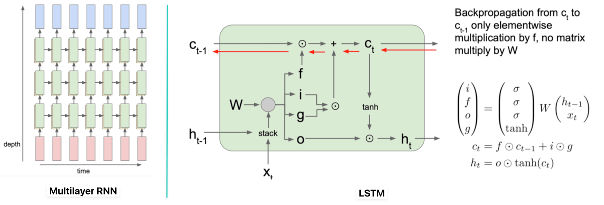
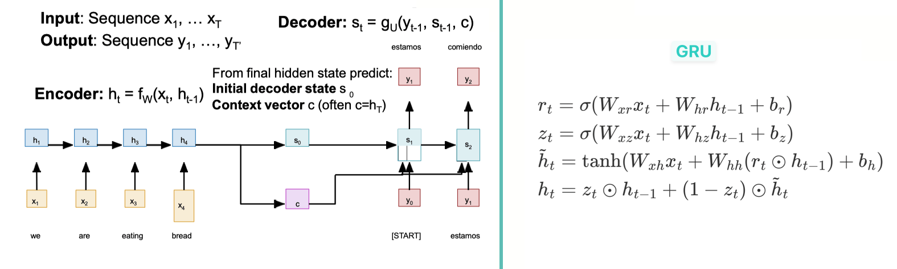
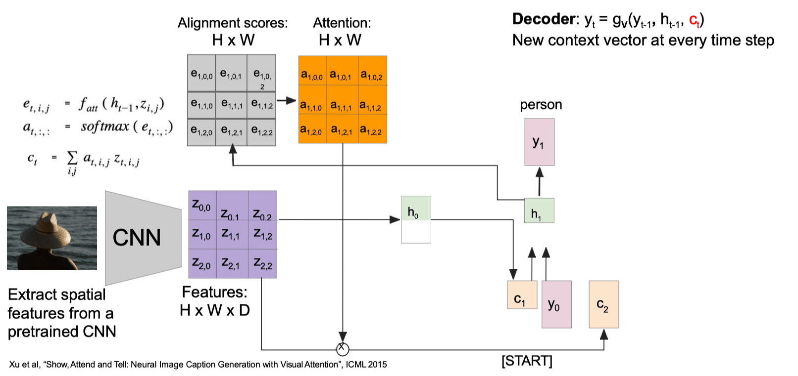

# 3D Vision

**PointNet++**：一个很 General 的模型，它甚至可以用在 MNIST 上（做数字分类）。在分类问题上，PointNet++是 **各向同性 Isotropic** 的（无法区分邻域点在不同相对位置上的信息），而 Conv 是 **各向异性 Anisotropic** 的。改进：HyerNetworks/KP-Conv 线性插值，但都烂。

**Voxelization (体素化)**：天然各向异性，将点云转换为 3D 体素网格，使用 4D 核（DHWC）进行 3D 卷积。**优点**：高效，支持索引，与 2D 卷积一样具有表现力、平移不变性。**问题**：贵。早期模型输入分辨率低（如 $30^3$），**离散误差（Discretization error）**即点云到体素的误差导致信息丢失，但可以存一下原始点云 avg local feature 进去。**Sparse Voxel**：只在表面占据格点。

**Sparse Convolution (稀疏卷积)**：体素化中大部分网格为空，故只存储和计算非零体素（表面信号）及其邻域的卷积（这种稀疏存储的体素数量甚至可能比原始点云的点数还要少，因为一个体素内可能包含多个点），输出也是稀疏的。**优点**：效率远高于密集卷积；Voxel 是可索引的规则网络；与 2D Conv 相似的表达能力和平移不变性。**缺点**：离散误差。

**稀疏卷积 vs. 点云网络**：1. **分辨率**：PCN 更高、细节更精细（但不一定就更好），SC 受限。 2. **各向性**：PCN 各向同性，SC 各向异性。 3. **效率**：SC 索引和邻域查询更高效，PCN 的 FPS 和球形查询较慢。 4. **易用性**：PCN 更易用，适合作为初步选择。 5. **场景规模**：SC 适用于大规模场景如激光雷达，PCN 性能略低、适用于小尺度精细场景如灵巧手。

# Sequential Data

**序列数据处理模式**：与顺序无关的点云不同，序列数据的顺序至关重要。

**RNN 核心思想**：关键在 **隐藏状态 (Hidden State)** $h$，它作为记忆单元，随序列输入不断更新。迭代：$h_t = f_W(h_{t-1}, x_t)$。**权重共享**：权重 $W$ 在所有时间步复用，使得模型能处理任意长度的序列，且对输入具有一定**对称性 Symmetry**。在每个时间步，可根据当前隐藏状态计算输出 $y_t = f_{W_{hy}}(h_t)$。

**Vanilla RNN**：$h_t=\tanh(W_{hh}h_{t-1}+W_{xt}x_t)$, $y_t=W_{hy}h_t$。每个输出 $y_t$ 产生一个损失 $L_t$，总损失 $L=\sum L_t$。计算量大，通常只在序列块（chunk）上反向传播（BPTT）。**优势**：1.RNN能以固定的参数量处理任意长度的输入；2.利用多步之前的信息；3. 在每个时间步上应用相同的权重，因此输入处理方式是等变的；4.模型大小不会因输入长度变长而增加。**劣势**：1. 循环计算很慢；2. 远距离的梯度信号容易丢失。

**BPTT (Backpropagation Through Time)**：由于权重 $W$ 共享，最终作用于 $W$ 的总梯度是所有时间步的损失回传到 $W$ 的梯度之和。**Truncated BPTT**：对于长序列，完整 BPTT 需巨大的计算/内存开销，故截断出反向传播的序列长度形成 chunks $\Delta T$ ，前向正常或每块初始部分都置为 $h_0$（序列过长时），反向只在窗口内计算、更新。若输入置为 $h_0$，则同时限制了模型学习长期依赖的能力（换取计算可行性的代价）。

**Character-Level Language Model Sampling**：将当前步输出 $y_t$ 作为下一步输入 $x_{t+1}$ 以生成序列。**Greedy sampling**：总是选概率最高的 token，完全确定性。**Weighted sampling**：按概率分布采样，更多样但可能采样出错导致后续崩盘。**Beam Search**：在每个时间步保留 $k$ 个最可能的序列，作为一种介于贪心和 $O(V^T)$ 的穷举搜索 **Exhaustive Search** $P(y|x) = \prod_{t=1}^{T} P(y_t | y_{<t}, x)$ 之间的策略，平衡效果与效率，**不保证找到全局最优解**。

**Embedding Layer**：在输入层和隐藏层之间加入，将 one-hot 向量映射为稠密向量，通常不参与反向传播。

**RNN 梯度问题**：$\frac{\partial h_t}{\partial h_{t-1}} = \tanh'(W_{hh} h_{t-1} + W_{xh} x_t) W_{hh}$，$\frac{\partial L_T}{\partial W} = \frac{\partial L_T}{\partial h_T} \left( \prod_{t=2}^{T} \frac{\partial h_t}{\partial h_{t-1}} \right) \frac{\partial h_1}{\partial W}$，$\frac{\partial L}{\partial W} = \sum_{t=1}^{T} \frac{\partial L_t}{\partial W}$，因反传时 tanh 梯度恒在 $(0, 1]$ ，易出现梯度消失。若无非线性激活，则变为 $\frac{\partial L_T}{\partial W} = \frac{\partial L_T}{\partial h_T} W_{hh}^{T-1} \frac{\partial h_1}{\partial W}$，梯度由权重矩阵 $W$ 的最大奇异值决定（大于 1 则爆炸，小于 1 则消失）。**Gradient Clipping**：缩放梯度（范数超过阈值则除范数缩放到阈值）来处理梯度爆炸问题，但无法解决梯度消失（RNN 更本质的问题）。

**Multilayer RNN**：多层 RNN 堆叠，前一层的隐藏状态是后一层的输入，以增强非线性表达能力和特征提取。本身不解决长程依赖问题。

**LSTM (Long-Short Term Memory)**：**记忆单元** $c$ 存储和传递长期信息，**输入门** $i$ 决定哪些新信息被存储，**遗忘门** $f$ 决定哪些旧信息被遗忘，**输出门** $o$ 决定从记忆单元中输出哪些信息，都用 $\sigma$ 激活到$(0,1)$。**候选门** $g$ 用 $\tanh$ 激活，取值$(-1,1)$，决定新信息的内容。**优点**：**LSTMs 不能保证解决梯度消失/爆炸问题，但能帮助学习长距离依赖关系**。当 $f=1,\ i=0$ 时，单元信息 $c$ 将一直保留。记忆单元 $c$ 实现了 **skip-link** 的功能，为模型提供类似 ResNet 的效果。**GRU (Gated Recurrent Unit)**：LSTM 的变体，合并了细胞状态和隐藏状态，门结构更简单，性能相当。

**加性互动（additive interaction）**：在反向传播时，从 $c_t$ 传向 $c_{t-1}$ 的梯度流非常直接，只经过一个逐元素的乘法（乘以遗忘门 $f$），而没有经过复杂的矩阵乘法和非线性激活函数的反复作用，从而可以缓解梯度消失，使得梯度可以几乎无衰减地长距离传播。

**Encoder-Decoder 架构**：**编码器** 是一个 RNN，读取完整输入序列并压缩成一个固定大小的 **上下文向量 $c$**，通常就是其最后一个隐藏状态。**解码器** 是另一个 RNN，接收 $c$ 作为初始信息，并以自回归方式生成输出序列，状态更新 $s_t = g(y_{t-1}, s_{t-1}, c)$，直到遇到终止符。

**信息瓶颈问题**：基本 Seq2Seq 架构要求将任意长度的输入压缩到 **固定大小** 的向量 $c$ 中，当输入序列过长时，会造成信息损失，影响模型性能。

**Image Captioning**：多模态应用，使用 CNN 提取图像特征，将该特征作为 RNN 解码器的初始隐藏状态，生成描述图像的文本。**早期**：存在信息瓶颈，所有描述都必须从一个静态的图像特征中生成。**引入注意力机制**：编码器 CNN 提取图像的空间特征图（$H \times W \times D$），解码器 RNN 在生成每个词时，会计算当前隐藏状态对图像不同区域的注意力权重，动态聚焦于图像相关部分。

**VQA (Visual Question Answering)**：多模态应用，分别用 CNN 和 RNN 提取图像和问题的特征，然后通过特征融合（如加法、逐元素乘法或拼接）来预测答案。确定最佳融合常依赖消融实验。**早期局限性**：1. **图像特征的提取与问题完全独立**，无法根据问题动态调整视觉注意力，即不同问题模型都使用相同的通用图像特征；2. 固定大小的上下文的瓶颈问题。
