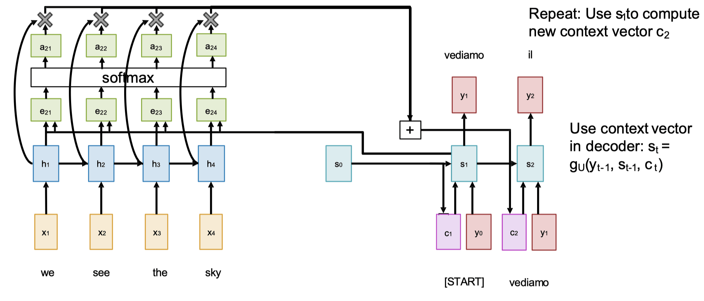
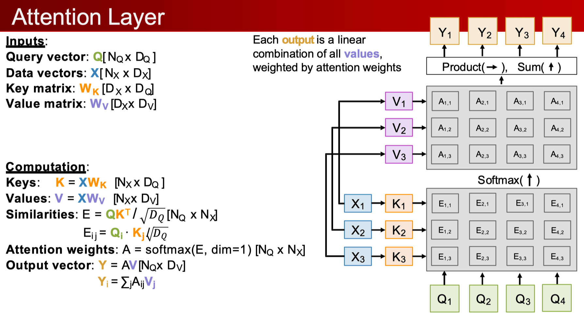
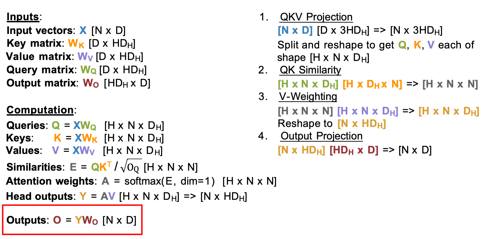
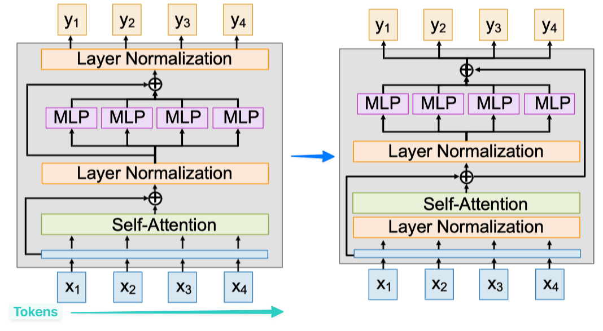

# Attention & Transformer

**Attention（RNN）**：将 QKV 映射到输出。Q 代表“要找什么”，K 代表“有什么信息”，V 代表“信息的具体内容”。通过计算 Q 和 K 的相似度得到权重（$f_{att}$，MLP），再对 V 进行加权求和。注意力权重通常对每个 Query 按列进行 Softmax 归一化，使得一个 Query 对所有 Value 的关注度之和为 1。**公式**：$e_{t,i} = f_{att}(s_{t-1}, h_i)$，$\alpha_{t,i} = \frac{\exp(e_{t,i})}{\sum_{j=1}^{T} \exp(e_{t,j})}$，$c_t = \sum_{i=1}^{T} \alpha_{t,i} h_i$，$y_t = \text{Encoder}(c_t, y_{t-1})$。**优点**：无消息瓶颈，每时间步动态获取上下文信息；端到端可微，自动学习无需对注意过程监督（模型自己领悟注意力权重）；可解释性。

**General Attention Layer**：1. **缩放点积** $\text{Attention}(Q, K, V) = \text{softmax}\left(\frac{QK^T}{\sqrt{d_k}}\right)V$；2. **QKV 投影** $K = XW_K$，$V = XW_V$，$Q = XW_Q$，这里的各处 $X$ 可以相同（自注意力），也可以不同（交叉注意力），如 $X_{Q}$ 可以是视觉特征，而 $X_{K/V}$ 来自文本特征，再投影后便具有了同样的维度进行相关性计算，增加了模型的通用性。**对于 X 不变，对于 Q 置换等变。**

**为什么缩放**：当向量维度 $d_k$ 很大时，点积的结果也可能变得非常大，导致 Softmax 函数进入饱和区（梯度接近于 0），使得梯度消失，模型难以训练。除以 $\sqrt{d_k}$ 有效缩放，可以缓解。

**为什么将 X 做 KV 分开投影而不直接用 X**：是为了 **解耦两个核心功能**：**相关性计算（KQ）** 和 **信息聚合/提取（V）**。QK 和 V 可以具有不同维度。

**Self-Attention**：Attention 特例，其中 Q, K, V 均来自同一个输入序列 $X_{Q}=X_{K}=X_{V}$。相比 CNN，自注意力具有全局感受野，能直接捕捉序列内任意两个位置间的依赖关系，**但对输入 X 的顺序是置换等变的（没有位置编码时）**，需要引入位置编码来保留位置信息。**实现只需要 4 个矩阵乘法。**

**Masked Self-Attention / Causal Attention**：用于解码器中，防止模型在预测当前位置时“看到”未来的信息。通过引入因果掩码，在计算注意力权重时将未来位置的分数设为 $-\infin$，使其 Softmax 后的权重趋近于零。完美保证自回归因果性、结合了 CNN 的并行性与 RNN 的时序性。

**Multi-Head Attention**：将 Q, K, V 通过不同的线性变换投影到多个“头”（head），在每个头中独立计算注意力，然后将所有头的结果拼接并再次进行线性变换。**优点**：1. 允许模型从不同的表示子空间中学习信息（为每个头学习独立的 $W_Q, W_K, W_V$ 矩阵），**表达能力更强**；2. **计算量与单头注意力基本相同**。

**三者比较**：**RNN** 的计算和空间复杂度均为 $O(N)$，但无法并行。**CNN** 可并行，但感受野有限，不适合长序列，需多层堆叠才能捕捉长距离依赖，内在处理顺序。**Self-Attention** 适合长序列，可并行，具有全局感受野，本身不感知顺序（置换等变，需要位置编码），计算复杂度 $O(N^2 \cdot D)$ （算 A、AV），空间复杂度 $O(N^2)$ （存 A 做 Softmax）。Flash Attention 可将空间复杂度优化至 $O(N)$，但计算复杂度不变。

**Transformer**：完全摒弃了 RNN 和 CNN，一个标准模块由**多头自注意力、残差连接与层归一化、前馈网络（FFN）、残差连接与层归一化堆叠**而成。自注意力层是唯一的向量间交互的地方，而 FFN 和 LayerNorm 对每个 Token 向量独立作用（沿 Token Dim 维度，$\mu_i = \frac{1}{D} \sum_{j=1}^{D} h_{i,j}$，$\delta_i = \sqrt{\frac{1}{D} \sum_{j=1}^{D} (h_{i,j} - \mu_i)^2 + \epsilon}$，$z_i = \frac{h_i - \mu_i}{\delta_i}$，$y_i = \gamma \odot z_i + \beta$，整个模型就是将这样的模块堆叠 L 次。

**Pre-Norm**：将层归一化（LayerNorm）移到自注意力和 FFN **之前**（即残差连接的分支上），而不是之后。这使得训练过程更稳定，因为模型更容易学习恒等映射，$y = x + \text{LN}(f(x))$

**RMSNorm**：一种更简单、高效的归一化方法，替代 LayerNorm。公式为 $y_i = \frac{x_i}{\sqrt{\varepsilon + \frac{1}{N} \sum_{i=1}^{N} x_i^2}} \cdot \gamma_i$。它只缩放向量使其 Norm 一致，而不像 LN 那样进行中心化（类似让结果服从高斯分布），训练更稳定。

**SwiGLU**：一种改进的前馈网络（FFN/MLP）结构，性能优于标准 FFN。其结构为 $(\delta(\mathbf{X}\mathbf{W}_1) \odot \mathbf{X}\mathbf{W}_2)\mathbf{W}_3$，其中 $\delta$ 为 Sigmoid/Swish，$\odot$ 为逐元素乘法。设置 $H = 8D/3$ 可以保持参数和 FFN（$D \to 4D \to D$）相同。

**MoE**：在一个模块中训练 E 个独立的 FFN（专家），但对于每个输入 Token，只通过一个可学习的路由（Routing）机制选择 A 个（A < E）专家进行计算。MoE 能以较小的计算成本（计算量提升 A 倍）实现巨大的模型参数量（参数量提升 E 倍），普遍采用。**训练挑战**：路由机制涉及不可导的选择操作，需平衡专家负载。**与标准 Transformer 比较**：1. 节省计算量（未路由到不参与计算）；2. 更难训练（Topk 不可导）。

**ViT**：将图像分割成不重叠的小块 (Patches)，每个块展平并线性投影成一个 Token，再加入 2D **位置编码（学习得到）**，送入标准 Transformer 编码器。图像任务中，所有 Token 之间可以互相关注，**无需掩码**。处理输出时，常对所有 Token 进行全局平均池化，再接线性层进行分类。

**多模态大模型**：本质是将不同来源的数据（文本、图像、声音等）都转化为统一的 **Token** 表示，然后用一巨大 Transformer 进行联合处理和学习。
