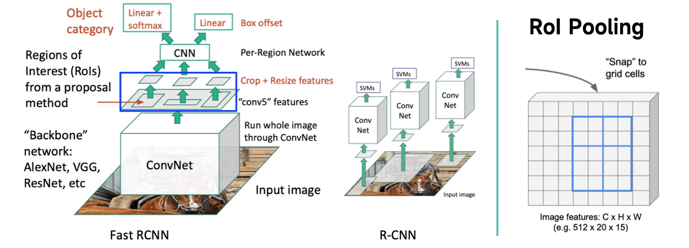
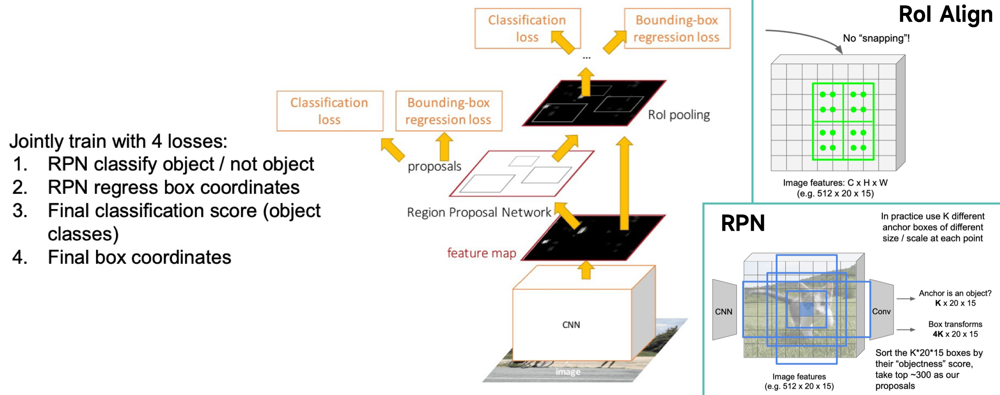
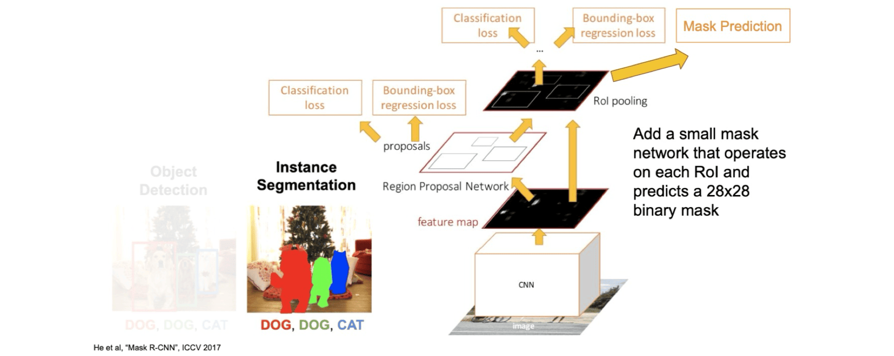

# Detection & Segmentation

**CV 四大任务**：分类（图像整体类别）、语义分割（像素级分类，不区分同类实例，Dense Prediction）、物体检测（识别并用框定位物体，但输出框的数量不确定）、实例分割（检测 + 分割，像素级轮廓且区分实例）。

**物体检测**：定位 + 分类，输出平行于坐标轴的边界框（**理想要 tight**），4 自由度 $(x, y, h, w)$ / $(cx, cy, w, h)$

**损失函数**：$L_{total} = L_{cls} + \lambda L_{reg}$。分类损失常用交叉熵；回归损失常用 Smooth L1 Loss。

**回归损失函数**：**L1** $\sum_{i \in \{x,y,w,h\}} |\hat{y_i} - y_i|$ 对异常值稳健但 0 点附近梯度不平滑，不利于模型在最优解附近精确收敛（震荡）。**L2** $\sum_{i \in \{x,y,w,h\}} (\hat{y_i} - y_i)^2$ 零点平滑但对异常值敏感，不等于 L2 Norm；**Smooth L1 Loss** 在误差小时似 L2 （保证平滑），误差大时似 L1 （控制梯度大小，稳健），分界点 $x=\pm1$ 梯度平滑，是常用选择。$\text {smooth}_{L_1}(x) =
\begin{cases}
0.5x^2 & \text{if } |x| < 1 \\
|x| - 0.5 & \text{otherwise}
\end {cases}$。

**RMSE** $\sqrt {\frac {1}{N} \sum_{i \in \{x,y,w,h\}} (\hat {y_i} - y_i)^2}$，**优点**：单位与目标变量一致，易于理解；对大误差的敏感度介于 L1 和 L2 之间。**缺点**：在误差接近 0 时梯度会趋向无穷，可能导致数值不稳定；对异常值（因平方操作）仍然比较敏感；较 L1 计算仍然复杂。

**滑动窗口**：用不同尺寸的框暴力遍历图像，对每个框块运行分类器。计算量巨大，效率极低。

**R-CNN 系列 （两阶段）**：核心思想是先生成候选区域，再对区域进行分类和回归。

**R-CNN**：Selective Search 提议～2k RoIs $\rightarrow$ 每个 RoI 独立缩放并送入 CNN 提特征 $\rightarrow$ SVM 分类 + 选择性回归。**问题**：对每个 RoI 重复 CNN 前向传播，计算冗余极大，速度极慢；多阶段训练非端到端；信息损失（RoI 裁剪并变形），使得边界框回归（尤其先缩小然后扩大时）缺乏依据，丢失分辨率。

**Fast R-CNN**：**共享 CNN 提取特征的计算步骤**，整图先过 CNN 得特征图 $\rightarrow$ RoI 投影到特征图上 $\rightarrow$ **RoI Pooling** 将不同尺寸 RoI 转为固定尺寸特征向量（实现：划分，然后将点吸附（Snap）在子网格上，子网格内最大池化，输出固定尺寸）。**优点**：主体（除 SS 外）端到端。**缺点**：外部算法 **Selective Search** 成为速度瓶颈；RoI Pooling 两次量化会损失精度，前向提特征（以及预测类别）都还好说，反向还原求原图边界框的时候失去了空间信息不好做。

**Faster R-CNN**：让网络自己学习生成候选区域。**区域提议网络 (Region Proposal Network, RPN)**，对主干特征图上的**每个点**，使用一组预设尺寸、长宽比的 **锚框 (Anchor Boxes)** 预测 **Objectness Score** （前景 / 背景概率）和 **Box Refinement** （边框微调），**在特征图上操作、全卷积很高效、可学习的**。**本质是一个两阶段检测器**，阶段一（RPN）粗提候选框，阶段二 （检测头） 筛掉低阈值+NMS 后精细分类定位。**问题**：RPN 对分数进行 topk 操作引入不可导，训练复杂，包含 4 个损失函数（RPN 分类损失、RPN 回归损失、最终分类损失、最终回归损失），通常采用交替训练或联合训练的方式。

**单阶段检测器 (YOLO)**：追求极致速度，一步到位。**核心思想**：将检测视为回归问题，将图像划分为粗糙网格，每个网格单元直接负责预测中心点落于此的物体的边界框和类别，本质是融合了 RPN 和检测头的功能。**优缺点**：速度极快，但早期版本精度和对小物体检测能力不如两阶段方法。

**NMS**：解决同一物体多个重叠检测框的问题。按置信度排序，保留最高分框，并移除与它 IoU > 阈值的其他框，迭代直至处理完所有框。$\text{IoU} = \text{交集面积} / \text{并集面积}$。注意 NMS **不可导**。

**评估指标**：**精确率 (Precision)** $\frac{TP}{TP+FP=Predict}$ (查准)；**召回率 (Recall)** $\frac{TP}{TP+FN=GT}$ (查全)。**AP (平均精度)** 是单一类别 P-R（R 横轴，P 纵轴）曲线下的面积。**mAP (平均精度均值)** 是所有类别 AP 的均值，为标准评估指标。**AP 计算依赖 IoU 阈值**，如$AP_{50}/AP@50$，IoU 阈值越高，对定位的要求越严格，通常 PR 曲线会更靠左下方，AP 值会更低。

**画 PR 曲线**：注意因变量不是精确率也不是召回率，是按照 conf 排序选点 top k% 的 k，可以出现锯齿。**11 点法** $AP \approx \frac{1}{11} \sum_{R \in \{0, 0.1, ..., 1.0\}} P(R)$，此时 $P(R) = \max\{P(r)\ \text{for}\ r > R \}$，曲线单调递减。

**自顶向下 (Top-down)**：先检测，再分割。即先用目标检测器找到物体的边界框，然后在每个框内进行二元分割（前景/背景）**Mask R-CNN** 是典型代表。

**自底向上 (Bottom-up)**：先分组，再分类。即先判断哪些像素属于同一个实例，将它们“簇”在一起形成掩码，然后再对每个掩码进行分类。

**Mask R-CNN**：在 Faster R-CNN 上并行增加掩码预测分支。核心创新是**RoI Align**，解决 RoI Pooling 因两次量化取整导致的**空间错位 (Misalignment)** 这一对边框回归的巨大问题。

**RoI Align**：取消硬性量化（避免取整），保留浮点坐标。当采样点不在特征图网格上时，使用**双线性插值**根据周围 4 个点计算其特征值，实现像素级对齐，极大提升掩码精度，得到精细边界，尤其在**高 IoU 阈值**（更严苛要求预测和真实轮廓重合）下。$f_{xy} = \sum_{i,j=1}^{2} f_{i,j} \max(0, 1 - \lvert x - x_i \rvert) \max(0, 1 - \lvert y - y_j \rvert)$

**掩码设计**：**类别相关**：为每个类别都预测一个独立的掩码（例如，80个类=80个掩码输出，Mask RCNN）。**类别无关**：只预测一个通用的“前景物体”掩码，类别由分类分支判断。**类别无关**（更简单）的方法效果与**类别相关**（更复杂）**几乎一样好**，表明掩码形状预测与类别判断任务可以有效解耦。

**像素分类**：**多项式预测（Multinomial）**：对每个像素在所有类别间使用 `softmax`，导致**类别间竞争**，一个像素只能属于一个类别。**独立预测（Independent）**：对每个类别的掩码使用独立的**逐像素 `sigmoid`** 和二元损失。**没有类别间竞争**，一个像素可以同时属于多个类的前景（处理重叠物体）。**独立预测显著优于多项式预测**。因为它解耦了类别预测，允许网络为每个类别独立学习其形状，而不会被其他类别干扰。

**3D目标检测**：通常输入为RGB-D或点云，自由度更高（如7 DoF：【x，y，z，w，h，l，yaw】）。**Frustum PointNet**：利用2D检测结果生成视锥（Frustum），在视锥内的点云上进行3D分割和检测。高效但依赖2D，无法处理遮挡。**VoteNet**：受霍夫变换启发，让点云中的每个点“投票”给它可能属于的物体中心，通过聚合投票来定位物体。纯3D，但对小物体（表面点少投票不集中）、密集场景（不同点干扰）不好。
