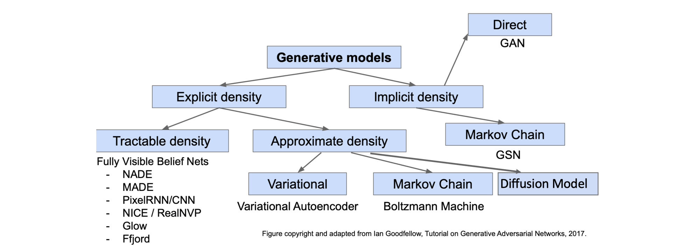

# Generative Models

**目标**：学习一个模型分布 $p_{\text{model}}(x)$ 来近似真实数据分布 $p_{\text{data}}(x)$，$x$ 可看做高维数据，$p$ 是概率密度函数（连续化了，可以大于 1），并能从 $p_{\text{model}}(x)$ 中采样新数据 $x$。**Explicit Density Model**：显式定义 $p_{\text{model}}(x)$。**Tractable（可处理）**：$p_{\text{model}}(x)$ 可以被精确计算，或其对数似然可被高效优化。**Approximate**：$p_{\text{model}}(x)$ 无法直接计算，需通过近似方法间接优化（VAE ELBO）。**Implicit Density Models**：无需显式定义 $p_{\text{model}}(x)$，直接学习采样过程（GAN）。生成模型不等于判别模型，学习数据的联合概率分布 $P(X, Y)$ 或数据本身的分布 $P(X)$。

**不可能三角**：VAE 缺乏高质量样本（High Quality Samples）；GAN 缺乏模式覆盖度/多样性（Mode Coverage/Diversity）；Diffusion 缺乏快速采样（Fast Sampling）。

**Fully Visible Belief Network (FVBN)**：利用链式法则 $p(x)=\prod p(x_i | x_{<i})$，将联合概率拆解为“第 i 个像素值在给定所有先前像素下的概率”的乘积。通过最大化训练数据的 $p(x)$ 来训练，例如 PixelRNN（可见副对角线以上区域） 和 PixelCNN（可见左上区域）。**优点**：可以显式计算似然函数 $p(x)$，生成高质量样本，容易优化。**缺点**：生成过程必须按顺序进行（**自回归**），速度较慢，且不符合直觉。

**Autoencoder（AE) **：将输入 $x$ 映射到唯一确定的隐变量 $z$（不建模概率），无法从 $z$ 空间采样生成，有效的 $z$ 实际是空间中的流形（manifold），在整个 $z$ 空间中可能极其微小。

**Variational Autoencoders (VAE)**：将 $x$ 编码为一个概率分布，并强制整个隐空间服从一个易于采样的先验分布（标准正态分布 $\mathcal{N}(0, I)$），学复杂的条件分布 $p(x|z)$。核心思想是用一个 Encoder $q_\phi(z|x)$ 来近似棘手的真实后验分布 $p_\theta(z|x)$。训练时优化的不是真实对数似然 $\log p_\theta(x) = \log \int p_\theta(x|z)p(z)dz$（积分导致 Intractable），而是其下界，ELBO。

**ELBO** $L(x^{(i)}, \theta, \phi) = E_z[\log p_\theta(x^{(i)}|z)] - D_{KL}(q_\phi(z|x^{(i)}) || p(z))$。

第一项是**重建项**，最大化给定潜变量 $z$ 时原始输入被重建的似然（实践中常扔掉方差项，简化为 L2 损失 $||x - \mu_{x|z}||^2$）；第二项是**正则项**，使近似后验 $q$ 与先验 $p(z)$ 尽可能接近。**核心矛盾**：重建项希望编码精确，KL 项希望编码趋同，二者的拉扯导致 VAE 生成的图像较为**模糊**。**Intractable 问题**：ELBO 中的期望 $E_z$ 仍是 **Intractable 棘手的**，需用蒙特卡洛方法采样 $z$ 来估计。**重参数化技巧**：前向 encoder 从 $q_\phi(z|x)$ 中采样 $z$ 的步骤是随机的，这会导致梯度无法回传。解决：训练时从 $\mathcal{N}(0, I)$ 中采样 $\epsilon$，结合 encoder 输出的均值和方差得到 $z = \mu_{z|x} + \epsilon \sigma_{z|x}$，使梯度能够反向传播。**推理 (Sampling)**：直接从先验分布 $p(z)$ 中采样 $z$，再通过解码器生成样本。**优点**：生成模型的原理性方法；提供可解释的潜空间；可进行 $q(z|x)$ 的推理用于其他任务，可插值观察到平滑变化（学习到了一个有意义且连续的隐空间，解耦了各主要变化因素）。**缺点**：优化的是下界，生成样本质量不如 GAN 和 Diffusion（MSE 导致倾向于平均化预测，失去高频细节）。

**Generative Adversarial Networks (GAN)**：**隐式密度**生成模型，包含一个生成器 (Generator) 和一个判别器 (Discriminator)，二者进行博弈。**目标函数** $\min_{\theta_g} \max_{\theta_d} [E_{x \sim p_{\text{data}}} \log D_{\theta_d}(x) + E_{z \sim p(z)} \log(1 - D_{\theta_d}(G_{\theta_g}(z)))]$。**训练伪码**：每轮迭代，判别器（真实+生成数据监督）可先梯度反传 $k$ 次（$k \ge 1$），生成器再反传一次（仅生成数据监督）。

**生成器非饱和损失 (Non-saturating Loss)**：实践中，最小化 $E_{z \sim p(z)} \log(1 - D(G(z)))$（蓝色曲线）在早期**梯度消失**，效果不好，因此改为最大化 $E_{z \sim p(z)} \log(D(G(z)))$（绿色曲线）。

**DCGAN 架构改进**：用步长卷积/分数步长卷积替换池化层；使用 BN 稳定数据分布；移除全连接层；生成器用 ReLU（输出层用 Tanh），判别器用 LeakyReLU。

**定性评估**：Nearest neighbors 对比生成样本与训练集最近邻，检测过拟合；User Study 让人类判断真伪。**定量评估**：Fréchet Inception Distance (FID) 将真实和生成样本集通过 Inception Net 提取特征，分别计算特征分布的均值 $\mu$ 和协方差 $\Sigma$，再用公式 $FID(r, g) = ||\mu_r - \mu_g||_2^2 + \text{Tr}(\Sigma_r + \Sigma_g - 2(\Sigma_r \Sigma_g)^{1/2})$ 计算距离。**FID 分数越低，表示生成图像的质量和多样性越接近真实图像**。FID 对图像失真（如噪声、模糊）非常敏感。

**Mode Drop/Collapse 模式崩溃**：生成器只学会了数据分布中可以骗过判别器的少数几个模式，无法覆盖多样性。

**优点**：生成样本质量高且美观（偏好多样性小、数据量大的情况），**可以进行语义向量运算/可解释性**。**缺点**：训练困难且不稳定；容易模式崩溃导致多样性不足；无法解决推断查询（Inference Queries）/概率推断，即计算 $p(x)$ 或 $p(z|x)$ 并基于此回答问题。

**Diffusion Model**：思想源于分层 VAE，可视为具有 T 个潜变量的特例（马尔科夫链），其独特之处在于前向过程固定无参数，且最终潜变量被设计为收敛到标准高斯分布。**前向加噪**：一个固定无需学习的马尔可夫链，在 T 步中逐渐向真实数据 $x_0$ 添加高斯噪声，最终得到 $x_T \sim \mathcal{N}(0, I)$。**反向去噪**：学习一个神经网络来逆转加噪过程，从纯噪声 $x_T$ 出发，逐步去除噪声，最终恢复出图像 $x_0$。

**训练目标**：在实践中被简化为反向时预测前向所加噪声。随机采样 $x_0$ 和时间步 $t$，生成加噪图 $x_t$，然后训练去噪网络 $\epsilon_\theta$ 预测在第 $t$ 步加入的真实噪声 $\epsilon$，损失函数通常为预测噪声与真实噪声间的均方误差 MSE。$L = \mathbb{E}_{x_0, \epsilon, t} [||\epsilon - \epsilon_\theta(\sqrt{\bar{\alpha}_t}x_0 + \sqrt{1-\bar{\alpha}_t}\epsilon, t)||^2]$。**可控条件生成**：通过引入条件信息 $y$（如文本），可实现强大的可控生成。**优点**：高质量、高多样性、条件生成灵活可控；**缺点**：采样速度慢，现用 DDIM 加速。
